# Week 1

Deze week zijn we begonnen met de Meesterproef. We hebben te horen gekregen met we we samen mogen werken en aan welke opdracht we mogen gaan werken. Ik werk samen met Pip en mag aan het project Duurzaam en sociaal Strandeiland gaan werken. Dit is een project van het participatieteam van de Gemeente Amsterdam. De opdracht is om een nieuwe functionaliteit toe te voegen aan de al bestaande website hallostrandeiland.nl. De functionaliteit die Pip en ik gaan maken is een plek op de website waar mensen ideeën/wensen kunnen plaatsen voor het nieuwe Strandeiland. Deze ideeën/wensen kunnen dan door andere mensen worden bekeken en zij kunnen dit idee/wens ook stuenen, helper of ambassadeur worden. De Gemeente Amsterdam gaat dan kijken wat voor ideeën/wensen er zijn en wat zij hiermee kunnen doen.

## Dinsdag 30 mei 2023

Vandaag was de kickoff van de Meesterproef en kregen we in de ochtend uitleg over wat er allemaal van ons verwacht wordt. Na deze kickoff zijn Pip en ik ons gaan voorbereiden op het gesprek dat we in de middag hadden met de opdrachtgever. Zo zijn we gaan bespreken wat we nu allemaal al weten. Dit hebben wij verwerkt in een mindmap. Ook hebben we met het andere groepje die ook deze opdracht heeft gaan bespreken wat we allemaal te weten willen komen. We hebben samen een lijst met vragen opgesteld. In de middag zijn we naar het kantoor van de opdrachtgever geweest en hebben we veel informatie opgedaan over wat ze precies willen en wat ze al hebben. Na de afspraak met de opdrachtgever zijn we meteen bezig gegaan met het maken van een debriefing. Dit hebben we voor een deel samen gedaan met het andere groepje en in deze debriefing hebben we alle informatie de we hebben gekregen verwerkt. Daarnaast zijn Pip en ik ook aan de slag gegaan met het verder aanvullen van de mindmap.

**Mindmap:**

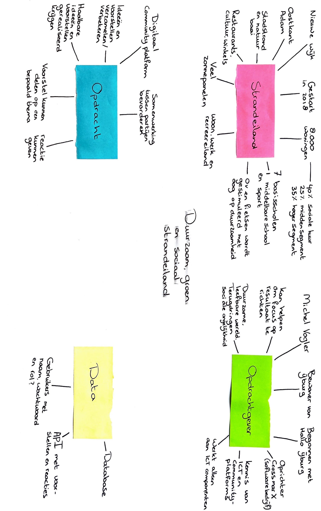 Mindemap met alle informatie die we wisten voor het gesprek met de opdrachtgever.

 

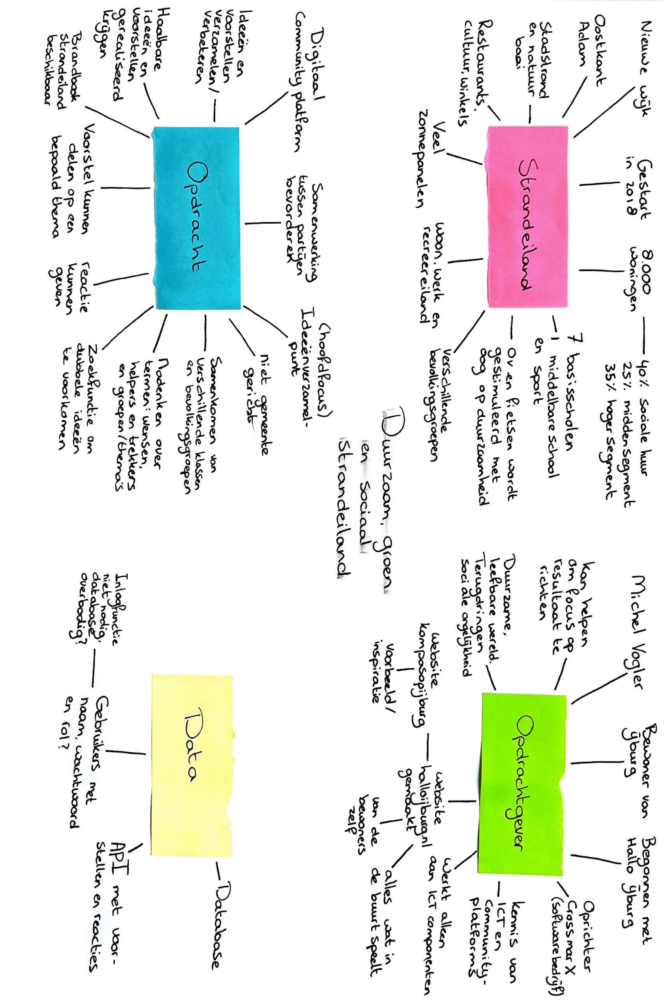 Mindmap uitgebreid met de informatie die we tijdens het gesprek met de opdrachtgever hebben gekregen.

## Woensdag 31 mei 2023

Vandaag hebben we in de ochtend eerst de debrief afgemaakt en samen gevoegd met het andere groepje. Deze hebben we opgestuurd naar de opdrachtgever en ook naar Koop de coach van dit project. Na het afmaken van de debrief zijn Pip en ik begonnen met het opzetten van het project. We hebben een repository aangemaakt, de wiki opgezet en issues aangemaakt. In de middag hadden wij ook een gesprek met Joost over hoe we het beste een API voor de data in de website kunnen maken. We hebben hierbij afgesproken dat Jevona met Supabase een API gaat maken en dat Pip en ik deze ook mogen gebruiken. Aan het einde van de dag zijn we gaan brainsromen over wat we precies kunnen gaan maken. Daarvan heb ik ook verschillende schetsen gemaakt deze zal ik hieronder plaatsen.

**Schetsen:**

Ideeën voor de icons die we kunnen gaan gebruiken voor het steunen, helpen en het worden van ambassadeur van een wens:

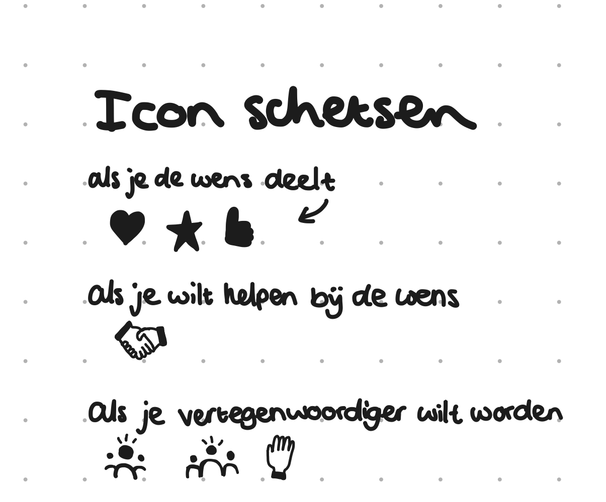

 

Ideeën voor het tonen van de personen die de wens steunen:

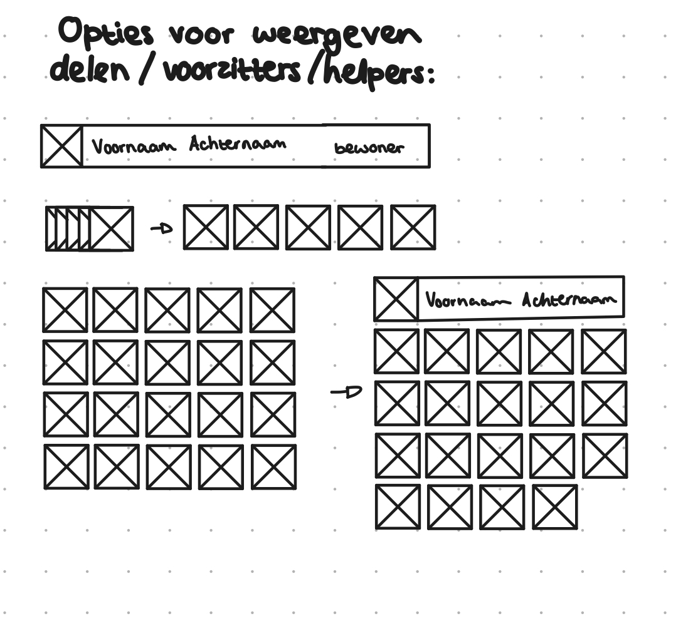

 

Eerste idee voor de overzichtpagina van de wensen:

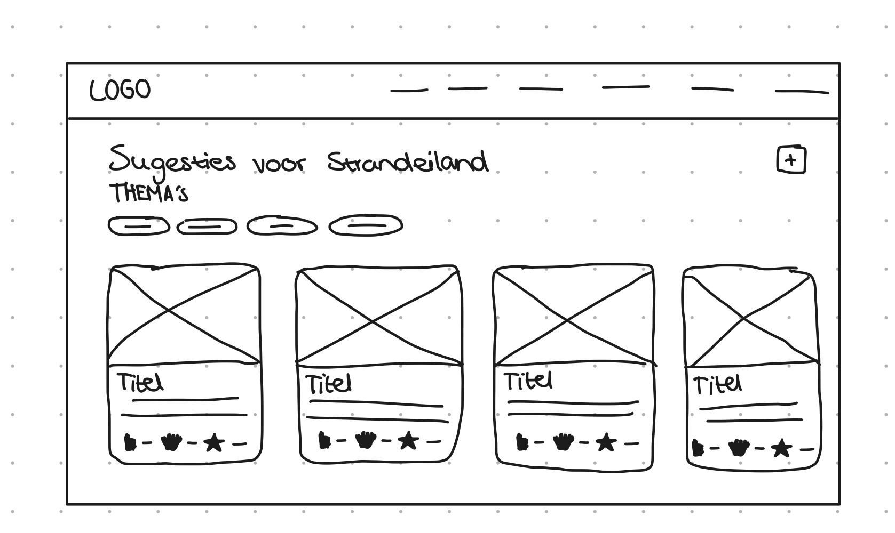

 

Idee op het idee van Pip waar zij de thema's in grote eilanden had geplaatst, waarin de wensen in eilandjes worden geplaatst. Ik heb er kleinere eilandjes van gemaakt om mee te filteren:

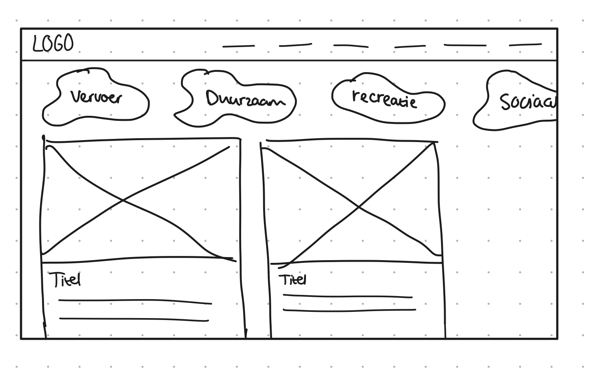

 

Idee voor het tonen van de wensen op een kaart, je kan op de stippen klikken om de bij behorende wens te zien en je kan filteren op de thema's:

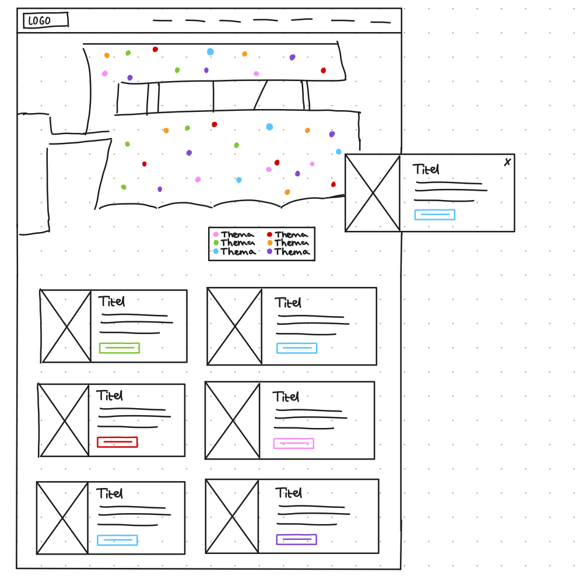

 

Idee voor de detail pagina van een wens, met daarbij bij welk thema de wens hoort en wie de wens steunen, trekker wil worden of wil helpen:

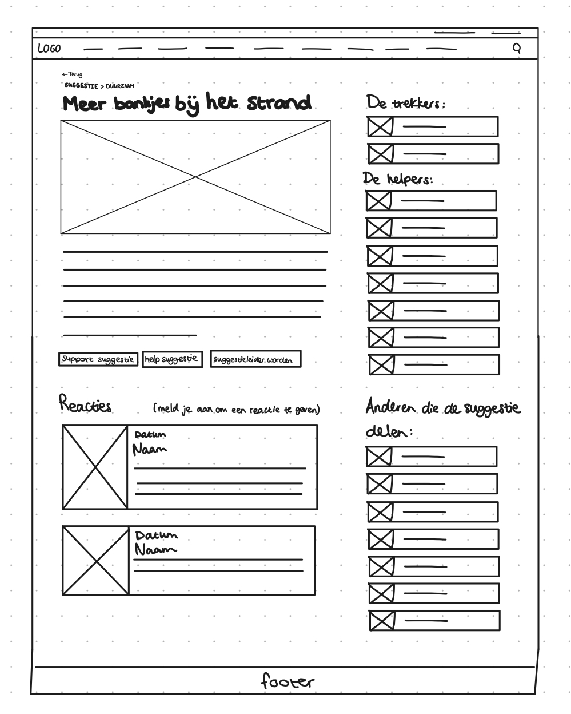

 

Idee voor de mobiele versie van de kaart. Hierbij zie je alleen het grid van de wensen en niet meer de kaart:

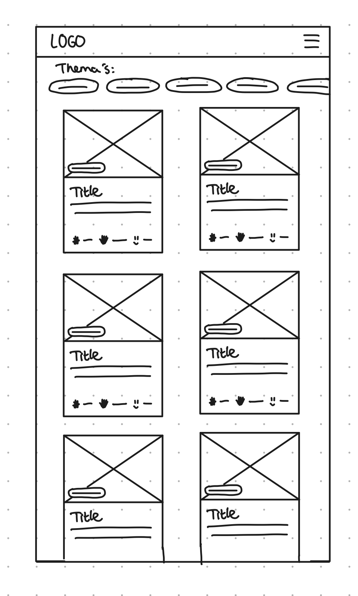

Na het schetsen ben ik begonnen met het uitwerken van mijn idee in Figma.

[Link naar Figma bestand](https://www.figma.com/file/OxPtwj3t9sXTU5buVAJU8n/Hallo-Strandeiland?type=design&node-id=0%3A1&t=NLp0LNPZ9u0MKcYO-1)

## Donderdag 1 juni 2023

Vandaag ben ik eerst verder gegaan met het uitwerken van het ontwerp in Figma. Ik heb uiteindelijk twee pagina's uitgewerkt en ben toen aan de slag gegaan met het opzetten van van de code. Het aanmaken van de files en de installeren van de benodigde packages. Daarna heb ik een branch aangemaakt en ben ik begonnen met het opzetten van een begin van mijn ontwerp.

**Afbeeldingen van het begin van het ontwerp:**

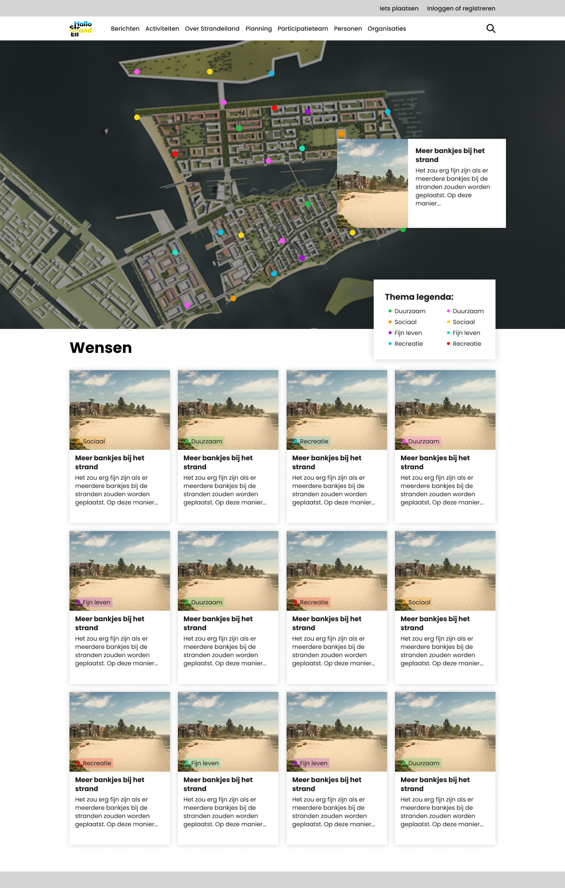

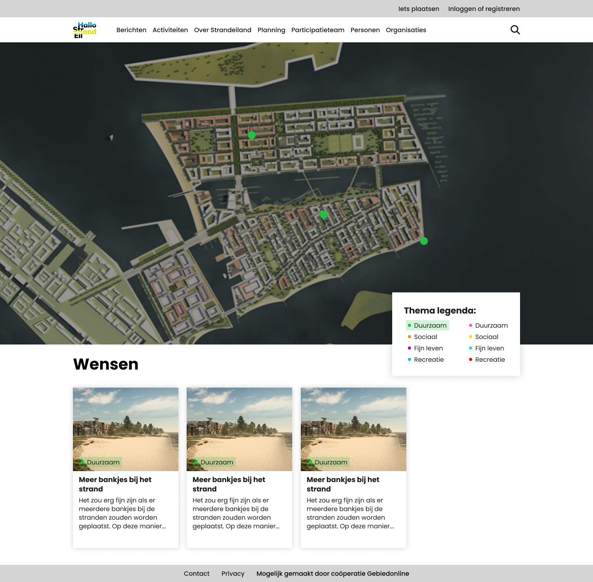

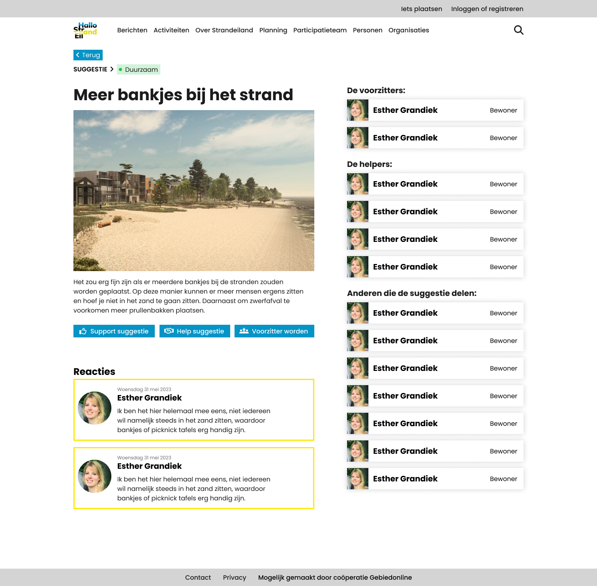

 

[Link naar mijn branch](https://github.com/PipHarsveld/Hallo-Strandeiland/tree/functionality-map)

## Vrijdag 2 juni 2023

Vandaag ben ik aan het begin van de ochtend eerst verder gegaan met de code van mijn begin van het opzetje. Nadat ik mijn onderdeel voor het gesprek verder had uitgewerkt ben ik met de presentatie aan de slag gegaan. Pip had namelijk een opzetje gemaakt voor de presentatie. Hierin heb ik alles wat ik had gemaakt ingezet, zodat we dat in de middag aan de opdrachtgever konden laten zien.

**Nieuw idee voor detail pagina wens:**

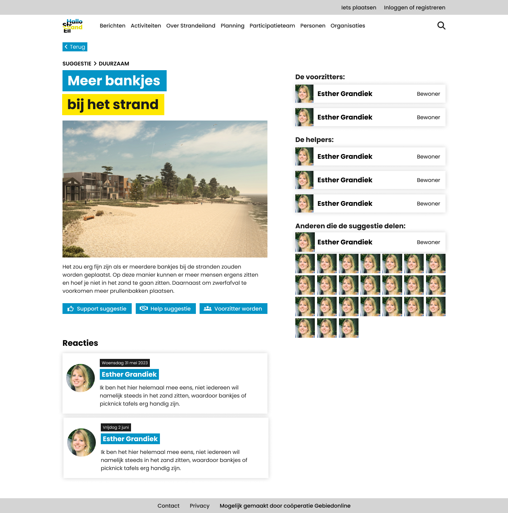

 

Nadat we de presentatie af hadden moesten we richting het kantoor van de opdrachtgever. Hier hebben we de presentatie gegeven en hebben we feedback gekregen. Nadat we terug kwamen van de presentatie hadden we de punten die we op de debriefing hadden gekregen terug gekregen verwerkt en de debrief opnieuw opgestuurd naar de opdrachtgever. Daarna ben ik aan de slag gegaan met het maken van een to do lijst.

[Link naar de presentatie](https://docs.google.com/presentation/d/1I34LNLzcuHkH1XOqICygzbiQXnI2_MItCO1NQABUpw4/edit#slide=id.p)

## Zaterdag 3 juni 2023

Vandaag ben ik aan de slag gegaan met het door lezen van de feedback en heb ik hier een nette lijst van gemaakt. Daarna ben ik aan de slag gegaan met het verwerken van de feedback in het ontwerp en ben ik verder gegaan met het verder uitschrijven van deze productbiografie.

[Feedback op eerste ontwerpen](https://github.com/PipHarsveld/Hallo-Strandeiland/wiki/Feedback)

## Zondag 4 juni 2023

Vandaag ben ik verder gegaan met het zoveel mogelijk verwerken van de feedback in het ontwerp. Dit zijn de pagina's geworden die ik heb ontworpen:

**Ontwerpen formulier:**

_Formulier ontwerp 1:_ Zwarte achtergrond bij de titels en in het midden uitgelijnd.

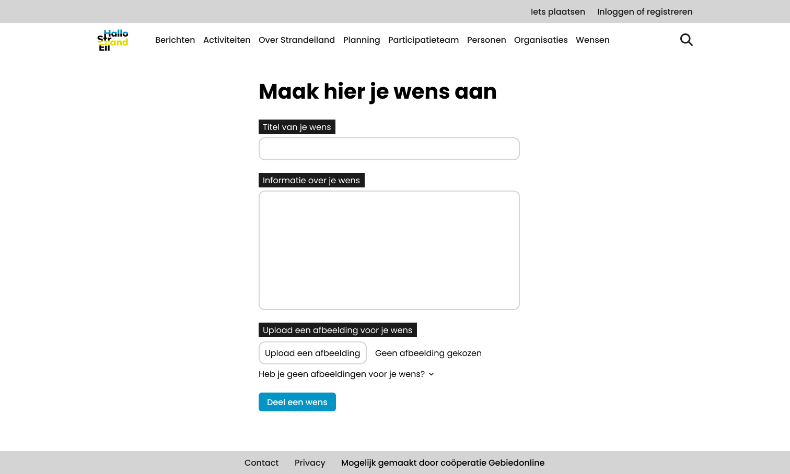

 

_Formulier ontwerp 2:_ Gele achtergrond bij de titels en in het midden uitgelijnd.

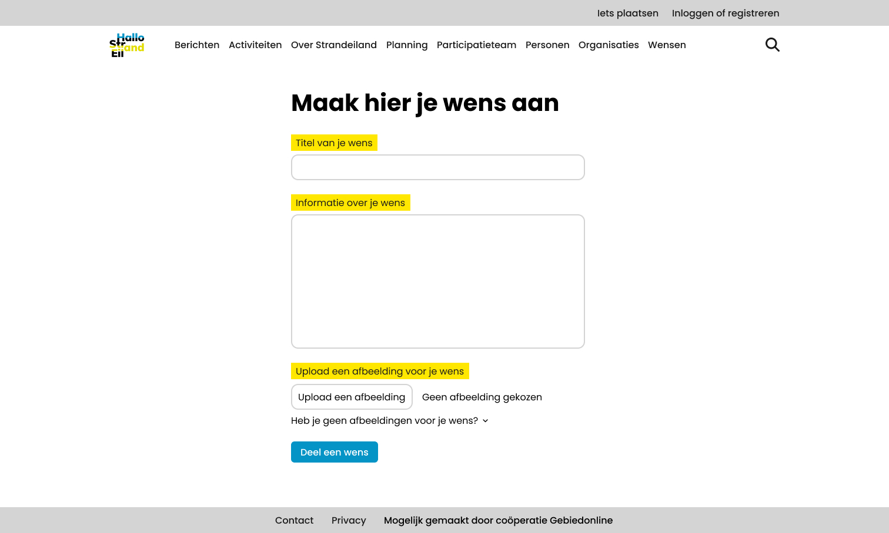

 

**Ontwerpen overzichtpagina:**

_Overzichtspagina wensen ontwerp 1:_ Titel met tekst en button in blok en bij de thema's staat een bolletje in de kleur van het thema.

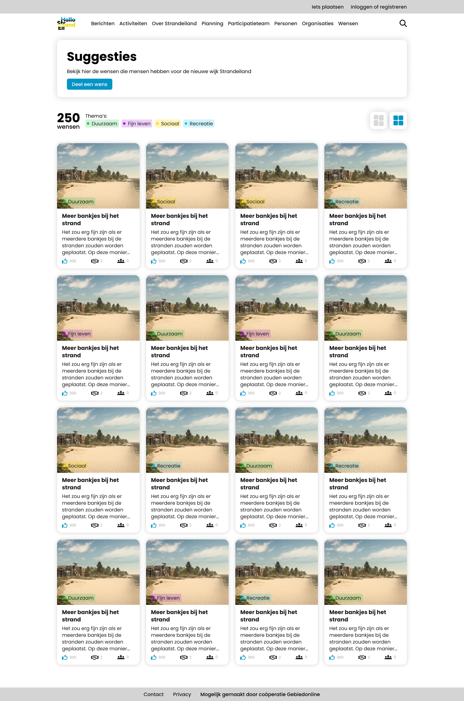

 

_Overzichtspagina wensen ontwerp 2:_ Titel met achtergrond en niet in een blok, thema's zonder bolletje, zodat ze kleiner zijn en begin gemaakt aan zoekbalk.

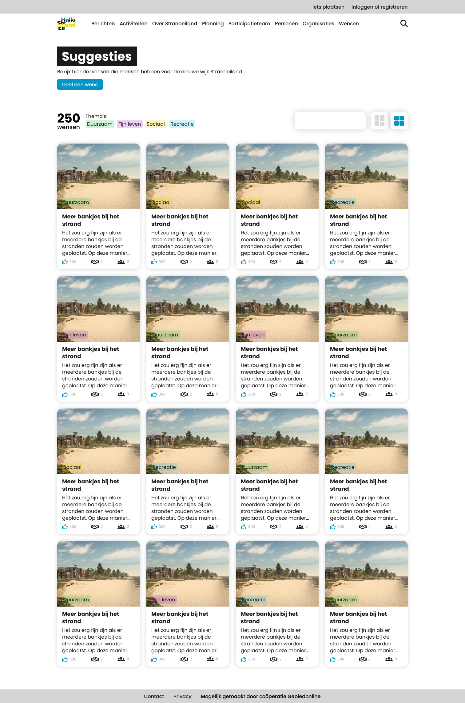

 

_Overzichtspagina wensen ontwerp 3:_ Andere filter optie inplaats van meteen in beeld met een knop die een popup opent.

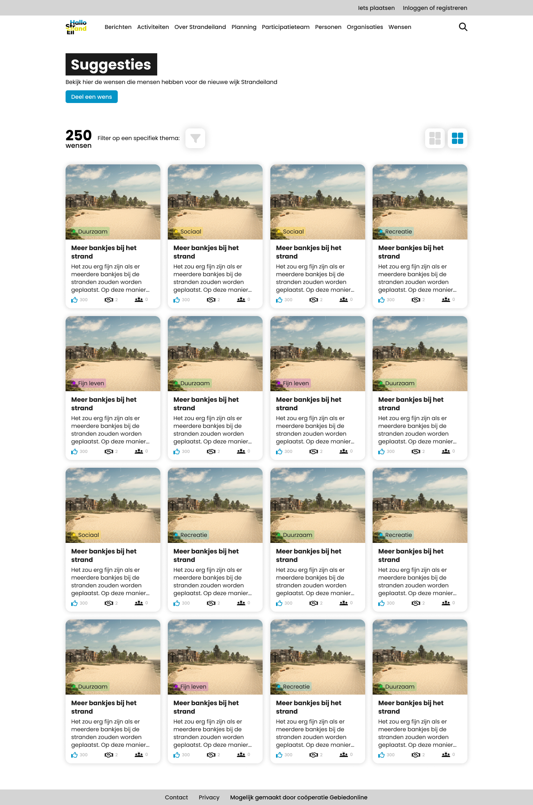

 

_Overzichtspagina wensen ontwerp 4:_ Titel, tekst en button bovenaan zonder blok of achtergrondkleur.

 

_Overzichtspagina zero state:_ Dit is een begin van de zero state. Doordat er nog geen wensen zijn geplaatst, zie je dat er nog geen wensen zijn aangemaakt en dat je er een aan kunt maken.

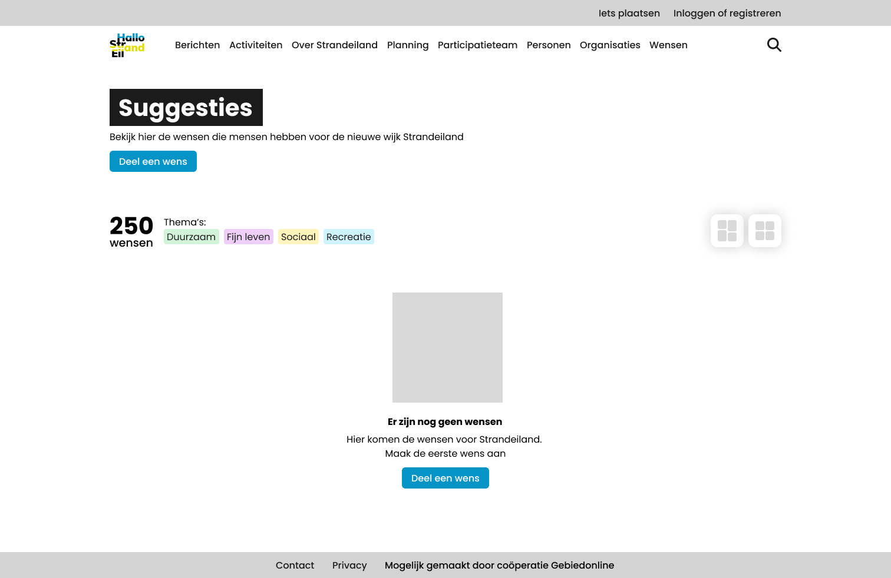

## Reflectie week 1

Deze week zijn Pip en ik begonnen met de meesterproef. Eerst wist ik niet zo goed waar we moesten beginnen. Het opstarten van een nieuw project vind ik altijd even lastig, maar door na het gesprek te beginnen met het uitwerken van een aantal ideeën ging het redelijk goed. Na dat ik een van mijn ideeën had uitgewerkt in Figma ben ik aan de slag gegaan met het opzetten van de code. Dit ging een stuk beter dan gedacht en had ik redelijk snel gedaan. Daarna hebben we afgesproken om in branches te gaan werken, zodat we beide onze eigen idee deels konden gaan uitwerken voor het gesprek. We hebben ook afgesproken hoe we de branches gaan noemen en hoe we commit messages gaan schrijven, zodat dit allemaal een beetje gelijk blijft.

In het eerste gesprek over wat we hebben gemaakt hebben we veel feedback gekregen, wat we beter kunnen doen en waar we nog even over na moeten denken. Hiervan heb ik een lijst gemaakt waarvan je een linkje bij zaterdag staat. En daar gaan we aankomende week mee aan de slag.

Over het algemeen ging de start van de Meesterproef erg goed, wel moet ik nog wel beter opletten dat ik overal issues van aanmaak en dat ik deze dan ook op de goede plek in het project zet. Dit heb ik namelijk nog niet echt vaak gebruikt, waardoor ik er niet altijd aan denk. Verder vond ik deze week erg goed gaan en ben ik tevreden met de eerste opzetjes die Pip en ik hebben gemaakt.
