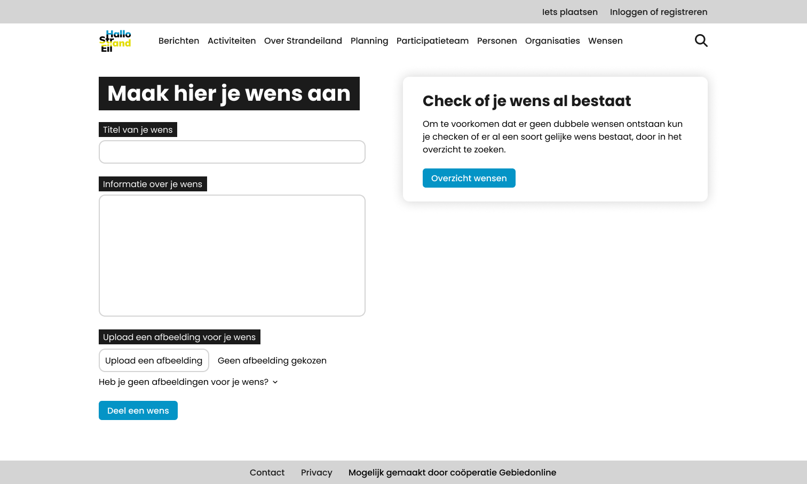

# Week 2

## Maandag 5 juni 2023

Vandaag ben ik de dag begonnen met het verder uitwerken van de pagina's in Figma. Zo heb ik samen met Pip nieuwe ontwerpen voor het formulier gemaakt, omdat we er graag nog een stukje tekst aan toe wilde voegen, over het checken of je wens niet al bestaat. Daarnaast heb ik ook nog een variatie daarp gemaakt door er een afbeelding bij te plaatsen. Dan ben ik ook nog bezig geweest met de wens detail pagina en de persoon detail pagina. Hieronder kun je ontwerpen bekijken.




Na het desigen heb ik nieuwe issues waar ik mee bezig ben geweest aangemaakt en deze op de juiste plek op het projectbord in GitHub geplaatst en degene die klaar zijn gesloten. Daarna ben ik aan de slag gegaan met een beginnetje maken aan het maken van het formulier in HTML en CSS.

## Dinsdag 6 juni 2023

Vandaag ben ik eerst verder gegaan met deze productbiografie, daarna hebben Pip en ik een online meeting gehad om te bespreken wat we vandaag gaan doen. Ik ben aan de slag gegaan met het opzetten van van de code voor het formulier, hier heb ik ook CSS aan toegevoegd. Toen ik dat af had ben ik aan de gang gegaan met het maken van de header en footer met HTML en CSS. Deze heb ik ook responsive gemaakt, zodat ze er ook goed uit zien op mobiel. Voor de header heb ik daarom een hamburgermenu gemaakt met JavaScript, zodat deze open en dicht kan klappen. Later zou het misschien nog mooi zijn om hier een animatie aan toe te voegen.

In de middag heb ik weer samen met Pip een meeting gehad om te bespreken wat we allemaal hebben gedaan en wat ik morgen moet vragen gedurende de code review. Dat was wat ik vandaag allemaal gedaan heb.

## Woensdag 7 juni 2023

Vandaag ga ik verder met de pagina met het formulier, hier ga ik validatie aan toevoegen, zodat er tekst komt te staan wanneer je bepaalde velden niet goed hebt ingevuld. Daarnaast had Pip nog een puntje om te verbeteren op de twee pull requests die ik had aangemaakt voor de header en footer. Dit heb ik aangepast en heb opnieuw een re-request aan gevraagd. Het valideren van het formulier vind ik tot nu toe best lastig, waardoor het minder snel gaat dan gehoopt. Tot nu toe heb ik het volgende voor elkaar gekregen met JavaScript:

```js
const wishForm = document.querySelector(".wish-form form");
const wishTitle = document.querySelector(".wish-form form input#title");
const wishDescription = document.querySelector(
  ".wish-form form textarea#description"
);
const wishError = document.querySelector(".wish-form form span.error");

let titleErrorShown = false;
let descriptionErrorShown = false;

wishForm.setAttribute("novalidate", true);

wishForm.addEventListener("submit", (e) => {
  e.preventDefault();
  console.log("Hello from wishForm");

  if (wishTitle.value === "" && wishDescription.value === "") {
    wishTitle.focus();
    if (!titleErrorShown) {
      wishTitle.insertAdjacentHTML(
        "afterend",
        '<span class="error">Voeg alsjeblieft een titel voor je wens toe.</span>'
      );
      titleErrorShown = true;
    }
    if (!descriptionErrorShown) {
      wishDescription.insertAdjacentHTML(
        "afterend",
        '<span class="error">Voeg alsjeblieft een uitleg over je wens toe.</span>'
      );
      descriptionErrorShown = true;
    }
  } else if (wishTitle.value === "") {
    if (descriptionErrorShown) {
      wishDescription.nextElementSibling.remove();
      descriptionErrorShown = false;
    }
    console.log("Please enter a title");
    wishTitle.focus();
    if (!titleErrorShown) {
      wishTitle.insertAdjacentHTML(
        "afterend",
        '<span class="error">Voeg alsjeblieft een titel voor je wens toe.</span>'
      );
      titleErrorShown = true;
    }
  } else if (wishDescription.value === "") {
    if (titleErrorShown) {
      wishTitle.nextElementSibling.remove();
      titleErrorShown = false;
    }
    console.log("Please enter a description");
    wishDescription.focus();
    if (!descriptionErrorShown) {
      wishDescription.insertAdjacentHTML(
        "afterend",
        '<span class="error">Voeg alsjeblieft een uitleg over je wens toe.</span>'
      );
      descriptionErrorShown = true;
    }
  } else {
    console.log("Formulier word verstuurd");
    console.log(wishTitle.value);
    console.log(wishDescription.value);
  }
});
```

Toen ik het voor elkaar had gekregen dat er meldingen komen en deze ook weg gaan als er een veld wel goed is ingevuld, ben ik aan de slag gegaan om de API aan de praat te krijgen. Dit lukte helaas niet meer voordat de Weekly Nerd begon, dus dat moet een andere keer afgemaakt worden.

## Donderdag 8 juni 2023

Vandaag ben ik naar CSS Day geweest. In de avond heb ik wel even een pull request beoordeeld en punten gecomment die aangepast kunnen worden, zodat het nog beter wordt. Dan had Jevona nog even naar de code voor de database gekeken en heb ik het linkje van Supabase aangepast en nu kunnen we data ophalen uit de API. Dit lukte namelijk eerst niet doordat ik een melding in de terminal kreeg. Dat is nu gelukkig opgelost. Daarna ben ik even aan de slag gegaan met mijn productbiografie.

De code die ik heb toegevoegd voor het werkend krijgen van de API:

```js
import bodyParser from "body-parser";
import { createClient } from "@supabase/supabase-js";

const supabase = createClient(
  "https://yyufywjwwwmgfjmenluv.supabase.co",
  `${process.env.API_KEY}`
);

app.use(bodyParser.json());

app.get("/thema", async (req, res) => {
  const { data, error } = await supabase.from("thema").select();
  res.send(data);
});
```

Om dit werkend te maken moest ik twee packages installeren:

1. npm install body-parser
2. npm install @supabase/supabase-js

## Vrijdag 9 juni 2023

Vandaag ben ik naar CSS Day geweest en heb ik niks meer voor de Meesterproef gedaan, behalve informatie opdoen, wat we eventueel kunnen gaan gebruiken in de opdracht.

## Zondag 11 juni 2023

Vandaag ben ik aan de slag gegaan met het verwerken van de feedback in het design in Figma. Daarna ben ik begonnen met het opzetten van de HTML van de persoon pagina.

De feedback punten die ik heb verwerkt in het design zijn:

- Op de detail pagina van een wens heb ik de delers aangepast naar dat je de eerste 10 delers ziet en dat de rest is ingeklapt. Dit heb ik gedaan, zodat je wel een aantal mensen ziet die de wens delen maar niet een hele lange lijst van mensen die de wens delen.
- Het design van het formulier aanpassen naar een ontwerp zonder afbeelding en met de thema's erbij.
- Overal de achtergrond kleur aanpassen naar licht grijs, zodat het consistent is met de huidige website.
- Filter ontwerp afmaken en toevoegen aan de overzicht pagina en het formulier.
- De tekst op de overzicht pagina aanpassen van Suggesties naar Wensen.

**Aangepaste ontwerpen:**

Detail pagina van een wens:


Formulier met achtergrond:


Formulier zonder achtergrond:

