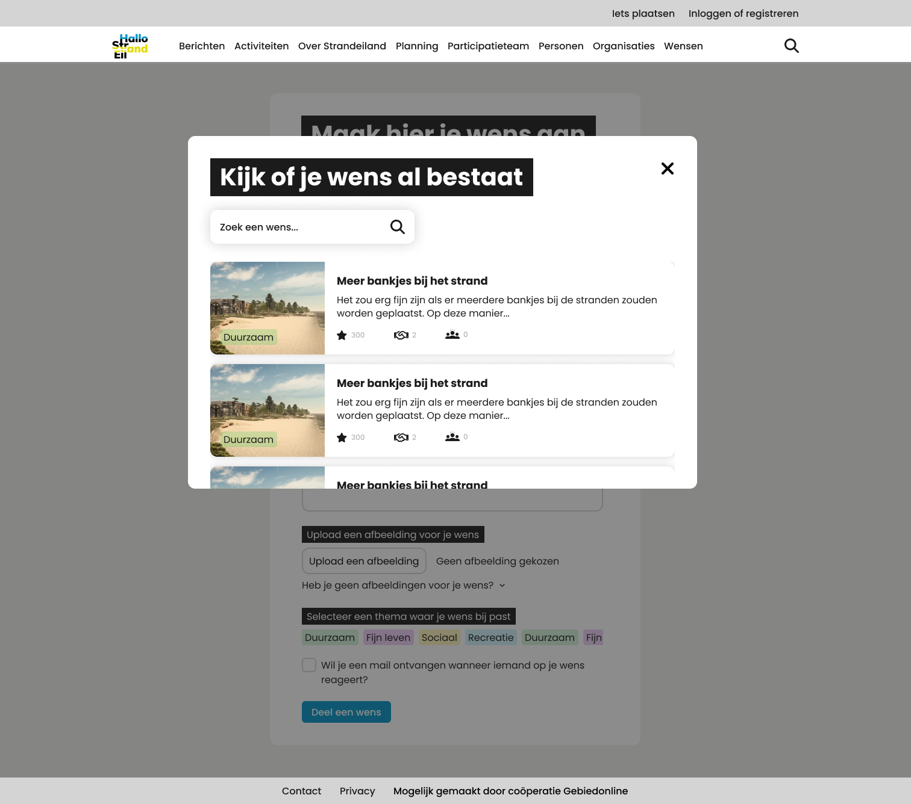
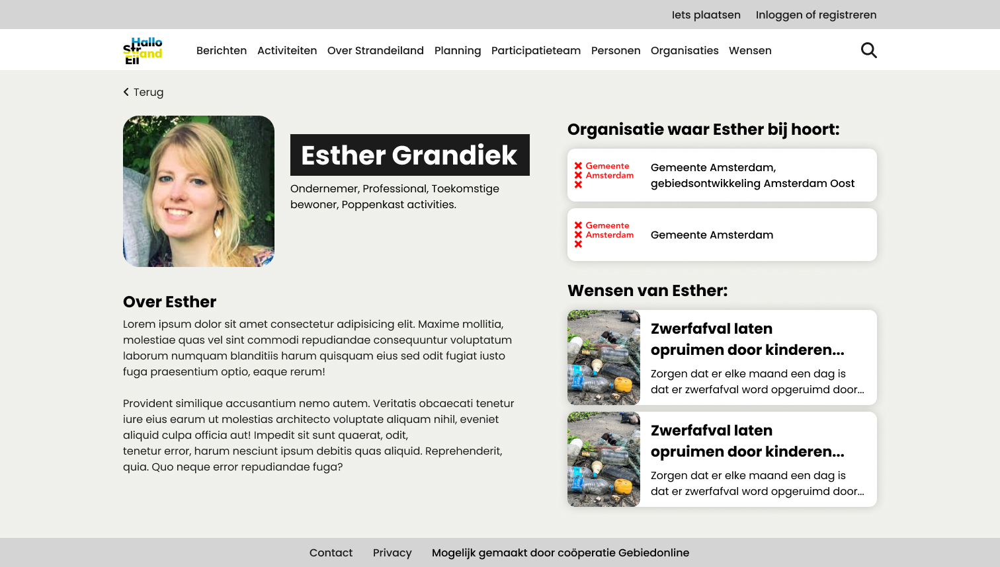

# Week 3

## Maandag 12 juni 2023

Vandaag ben ik begonnen met het opzetten van de HTML en CSS voor de persoon pagina. Daarna ben ik even aan de slag gegaan met de popup waar je een overzicht van de wensen kunt bekijken om te kijken of je wens niet al bestaat. Deze kun je hieronder bekijken. Na dat ik die ontwerpen af had ben ik verder gegaan met het bouwen van de HTML en CSS voor de persoon pagina. Deze heb ik aan het einde van de dag afgekregen en kun je vinden op de branch `page-person`. Tussendoor hebben Pip en ik ook verschillende dingen besproken waaronder de nieuwe designs die ik heb gemaakt en daar heb ik dan ook wat dingen aan verbeterd.





[Link naar branch page-person](https://github.com/PipHarsveld/Hallo-Strandeiland/tree/page-person)

```html
<main class="person">
  <button class="button-back">Terug</button>
  <section>
    <div>
      <div>
        <h1>Esther Grandiek</h1>
        <p>
          Ondernemer, Professional, Toekomstige bewoner, Poppenkast activities.
        </p>
      </div>
      
    </div>
    <article>
      <h2>Over Esther Grandiek</h2>
      <p>
        Lorem ipsum dolor sit amet consectetur adipisicing elit. Maxime mollitia
        molestiae quas vel sint commodi repudiandae consequuntur voluptatum
        laborum numquam blanditiis harum quisquam eius sed odit fugiat iusto
        fuga praesentium optio, eaque rerum!
      </p>
      <p>
        Provident similique accusantium nemo autem. Veritatis obcaecati tenetur
        iure eius earum ut molestias architecto voluptate aliquam nihil, eveniet
        aliquid culpa officia aut! Impedit sit sunt quaerat, odit, tenetur
        error, harum nesciunt ipsum debitis quas aliquid. Reprehenderit, quia.
        Quo neque error repudiandae fuga?
      </p>
    </article>
  </section>
  <aside>
    <h2>Organisatie waar Esther bij hoort:</h2>
    <ul>
      <li>
        <h3>Gemeente Amsterdam, gebiedsontwikkeling Amsterdam Oost</h3>
        
      </li>
      <li>
        <h3>Gemeente Amsterdam</h3>
        
      </li>
    </ul>
    <h2>Wensen van Esther:</h2>
    <ul>
      <li>
        <h3>Zwerfafval laten opruimen door kinderen...</h3>
        <p>
          Zorgen dat er elke maand een dag is dat er zwerfafval word opgeruimd
          door...
        </p>
        
      </li>
      <li>
        <h3>Zwerfafval laten opruimen door kinderen...</h3>
        <p>
          Zorgen dat er elke maand een dag is dat er zwerfafval word opgeruimd
          door...
        </p>
        
      </li>
    </ul>
  </aside>
</main>
```

Nu zie je dat alles nog hard coded is, maar dit gaan we binnenkort aanpassen zodat het vanuit de API wordt opgehaald.

## Dinsdag 13 juni 2023

Vandaag ben ik aan de slag gegaan met de detail pagina van de wens. Deze pagina zou Pip eerst uitwerken in HTML en CSS, maar omdat de pagina met het overzicht meer werk kost, ga ik deze maken. Hier ben ik de hele ochtend mee bezig geweest en daarna ben ik aan de slag gegaan met een paar bugs in de header. Deze zijn nu ook opgelost.

De rest van de dag ga ik verder met het formulier. Ik ben bezig geweest met server validatie maar dit snap ik niet helemaal en het werkt ook allemaal niet wat ik probeer. Dus ik ga hier morgen hopelijk mee verder.

[Branch link wens pagina.](https://github.com/PipHarsveld/Hallo-Strandeiland/tree/page-wish)

## Woensdag 14 juni 2023

Vandaag ben ik de dag begonnen in de trein met ervoor zorgen dat je in een inputveld een linkje naar een afbeelding kan invullen en dat deze dan eerst als preview word weergeven en wanneer je dan op submit klik op de volgende pagina komt.

Mijn code hiervoor:

Server side:

```js
function isValidImageUrl(url) {
  const imageRegex = /^https?:\/\/.*\.(png|jpg|jpeg|gif)(\?.*)?$/i;
  return imageRegex.test(url);
}

app.post("/upload", (req, res) => {
  const imageLink = req.body.imageLink;
  console.log(imageLink);

  if (!isValidImageUrl(imageLink)) {
    return res.status(400).send("Invalid image URL");
  }

  res.redirect("/image?link=" + imageLink);
});

app.get("/image", (req, res) => {
  const imageLink = req.query.link;
  console.log(imageLink + " in /image");
  res.render("image", { imageLink });
});
```

HTML:

```html
<form action="/upload" method="post">
  <input
    type="text"
    name="imageLink"
    id="imageLink"
    placeholder="Voer hier de link van de afbeelding in"
  />
  <button type="submit">Upload Afbeelding</button>
</form>

<div id="imagePreview"></div>
```

Client side:

```js
const imageLinkInput = document.getElementById("imageLink");
const imagePreview = document.getElementById("imagePreview");

imageLinkInput.addEventListener("input", () => {
  imagePreview.innerHTML = ``;
});
```

Met deze code krijg je wanneer je een link naar een afbeelding in het inputveld invult eerst een preview te zien en wanneer je dan op de submit button klikt, komt deze ook op de volgende pagina te staan.

Nu ga ik nog verder proberen om de validatie goed te krijgen, want de validatie in bovenstaande code werkt nog niet goed.

In de middag had ik een code review met Joost en die gaf aan dat ik de sever side validatie beter even kon laten zitten en mij eerst moet gaan focussen op de rest. Het zou namelijk leuk zijn om dat te hebben maar de rest moet ook gebeuren. Dus nu ga ik eerst verder met het proberen om een wens via het formulier naar Supabase te sturen.

In de avond is het eindelijk gelukt met hulp van Jevona om een wens naar Supabase te sturen. Dit is gelukt met de volgende code:

```js
router.post("/wens", async (req, res) => {
  try {
    const { error } = await supabase.from("suggestion").insert({
      title: req.body.title,
      description: req.body.description,
      theme: 1,
      image: req.body.imageLink,
    });
    if (error) {
      throw error;
    }
    res.status(200).json({ message: "Wens succesvol toegevoegd" });
  } catch (error) {
    res.status(500).json({
      error: "Er is een fout opgetreden bij het toevoegen van de wens",
    });
    return;
  }
  res.redirect("/wens");
});
```

## Donderdag 15 juni 2023

Vandaag hadden we de presentatie voor de opdrachtgever. Hier hebben we de opdrachtgever laten zien wat we tot nu toe allemaal hebben gedaan en verbeterd. Michel had een aantal punten waar we nog naar moeten gaan kijken. Hier ga ik volgende week verder mee aan de slag.

Feedback punten:

- Button formulier misschien opslaan in plaats van delen een wens.
- Afbeelding formulier altijd formaat 4 staat tot 3.
- Kijken naar detail wens pagina, hoe meerdere thema's.
- Kijken op detail wens pagina, hoe meerdere delers laten zien.
