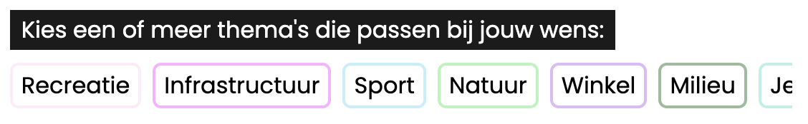
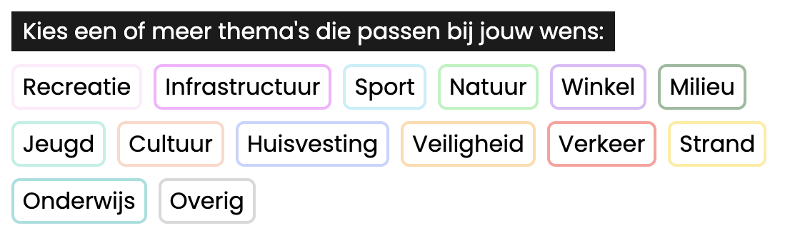
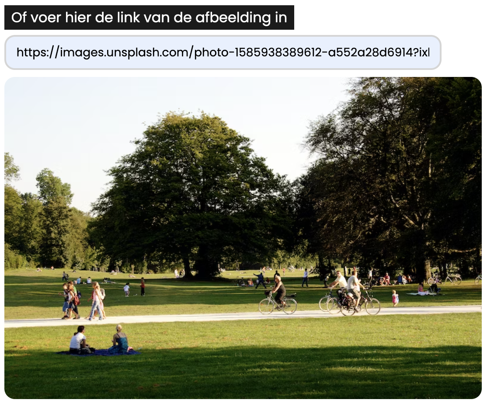
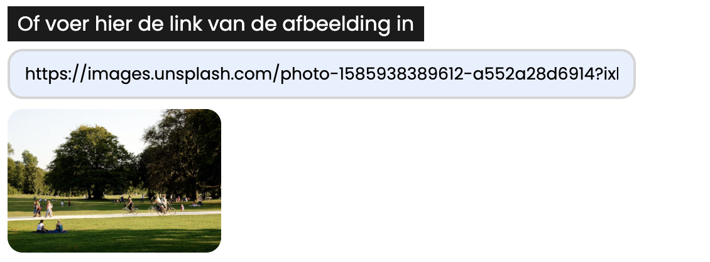

# Week 4

## Maandag 19 juni 2023

Vandaag ben ik even aan de slag geweest met het verder stijlen van het formulier. Zo ben ik aan de slag gegaan met de thema's, deze heb ik zo gestijlt dat ze nu onder elkaar staan inplaats van naast elkaar en dat je dan moet scrollen.

**Before:** <br>
Scrollen door de thema's is niet voor iedereen handig.



<br>

**After:** <br>
Daarom zie je nu de thema's meteen allemaal.



Daarna ben ik bezig geweest met het stijlen van de afbeelding die je te zien krijgt als je een link toevoegd.

**Before:** <br>
De afbeelding wordt nu erg groot weergegeven.



<br>

**After:** <br>
Daarom heb ik deze kleiner gemaakt, zodat je sneller de rest van het formulier ziet.



<br>

Als laatste ben ik bezig geweest met het verder schrijven van de readme. Voor de readme heb ik een stukje geschreven over hoe je het project kan installeren en dat we gebruik maken van een API en dat je die zelf kan maken met Supabase.

## Dinsdag 20 juni 2023

Vandaag ben ik eerst bezig geweest met het goed toegankelijk maken van het formulier. Ik kwam er namelijk achter dat de thema's niet met tab bereikbaar waren. Daarom heb ik ze omgebouwd en opnieuw gestijlt, zodat ze nu wel met tab bereikbaar zijn. Ook heb ik de :focus state voor de andere velden mooi gemaakt.

```handlebars
<ul>
  {{#each themes}}
    <li>
      <label for="{{this}}">{{this}}</label>
      <input
        type="checkbox"
        name="theme"
        id="{{this}}"
        value="{{incrementIndex @index}}"
      />
    </li>
  {{/each}}
</ul>
```

```css
main.wish-form section form input:focus-visible,
main.wish-form section form textarea:focus-visible {
  outline-offset: 0.15rem;
  outline: 0.125rem solid var(--color-button-primary);
  border-radius: 0.1875rem;
}

main.wish-form section form > ul li input:focus-visible {
  outline-offset: 0.25rem;
}
```

Rond kwart over 9 heb ik met Pip besproken wat zij de dagen dat ik er niet was heeft gedaan en wat er allemaal nog moet gebeuren. Zo had Pip een aantal pull requests en issues aangemaakt, waar ik op moest reageren of even naar moest kijken of ik wist hoe ze dit kon oplossen. De eerste pull request waar ik naar heb gekeken ging over het splitten van de CSS, zodat het overzichtelijker werd. Hier had ik een kleine aanpassing voor aangegeven om de namen van de bestanden aan te passen, zodat er geen hoofdletters in zitten. Dit kan namelijk soms voor problemen zorgen.

Daarna heb ik naar de pull request over het refactoren van de overview page en het maken van de partial voor de wishcard. Deze zagen er goed uit en heb ik na het checken goedgekeurd.

Dan waren er nog twee issues waar ik naar moest kijken. De eerste issue ging over wat ik ervan zou vinden als het masonry grid er net anders uit zou komen te zien. Hierop heb ik gereageerd dat ik het goed vond omdat het andere te moeilijk is om in deze tijd voor elkaar te krijgen. Bij de tweede issue had Pip hulp nodig bij het het switchen tussen het masonry grid en het normale grid. Hier probeerde ze de goede selector te vinden, om dit met CSS te doen. Hier heb ik naar gekeken en heb ik een oplossing voor gevonden. Maar uiteindelijk kwamen we erachter dat deze oplossing niet helemaal goed is. Omdat masonry alleen in Firefox werkt en :has daarin niet werkt. Dus hier ga ik morgen nog even naar kijken.

Dit was de oplossing die ik had bedacht:

```css
.filterBar:has(form:nth-of-type(2) .gridBtn > input:checked)
  + .themeFilters
  + .grid {
  grid-template-rows: auto;
  background-color: red;
}
```

Als laatste ben ik weer gaan kijken naar het verzenden van het formulier naar Supabase. Hier waren wat dingen weer in veranderd die ik nog niet goed had begrepen en wist hoe ik voor elkaar moest krijgen. Met wat hulp van Maijla heb ik voor elkaar gekregen om de wens naar Supabase te sturen. Dit heb ik gedaan met de volgende code:

```js
router.post("/wens", async (req, res) => {
  try {
    const { data, error } = await supabase
      .from("suggestion")
      .insert([
        {
          title: req.body.title,
          description: req.body.description,
          image: req.body.imageLink,
        },
      ])
      .select(); // De wens wordt toegevoegd aan de suggestion tabel

    const insertId = data[0].id ?? null; // Er wordt een array teruggegeven, maar we willen alleen het id van de eerste entry hebben (die we net hebben toegevoegd) met dank aan de hulp van Maijla

    if (error || !insertId) {
      throw error; // Als er een error is, of als er geen insertId is wordt er een error gegooid
    }

    const { error: themeError } = await supabase
      .from("suggestion_theme")
      .insert([
        {
          suggestionId: insertId,
          themaId: req.body.theme,
        },
      ]); // De thema's worden toegevoegd aan de suggestion_theme tabel

    if (themeError) {
      throw themeError; // Als er een error is wordt er een error gegooid
    }

    res.render("main", {
      layout: "index",
      message: "Wens succesvol toegevoegd",
    });
  } catch (error) {
    res.status(500).json({
      error: "Er is een fout opgetreden bij het toevoegen van de wens",
    });
    console.log(error);
    return;
  }
});
```

In de avond ben ik nog even verder gegaan om al een deel van de popup te maken, die in het formulier moet komen. Dit heb ik gedaan met een dialog. De code kun je hieronder zien.

```html
<button id="dialog-btn">Show the dialog</button>
<dialog id="dialog">
  <h2>Kijk of je wens al bestaat</h2>
  <button value="cancel" formmethod="dialog" id="dialog-close">Sluiten</button>
  <form>
    <input
      type="search"
      id="search"
      name="search"
      placeholder="Zoek een wens..."
    />
    <svg xmlns="http://www.w3.org/2000/svg" viewBox="0 0 512 512">
      <path
        d="M416 208c0 45.9-14.9 88.3-40 122.7L502.6 457.4c12.5 12.5 12.5 32.8 0 45.3s-32.8 12.5-45.3 0L330.7 376c-34.4 25.2-76.8 40-122.7 40C93.1 416 0 322.9 0 208S93.1 0 208 0S416 93.1 416 208zM208 352a144 144 0 1 0 0-288 144 144 0 1 0 0 288z"
      />
    </svg>
  </form>
  <ul>
    {{#each whises}}
    <li>
      <a href="/wens/{{this.id}}"> {{this.title}} </a>
    </li>
    {{/each}}
  </ul>
</dialog>
```

```js
const dialogBtn = document.querySelector("#dialog-btn");
const dialog = document.querySelector("#dialog");
const dialogCloseBtn = document.querySelector("#dialog-close");

dialogBtn.addEventListener("click", () => {
  dialog.showModal();
});

dialogCloseBtn.addEventListener("click", () => {
  dialog.close();
});
```

```css
/* Dialog button */
main.wish-form article button#dialog-btn {
  padding: 0.375rem 1rem;
  border: 2px solid var(--color-button-primary);
  border-radius: 0.375rem;
  margin-top: 0;
  display: inline-block;
  text-decoration: none;
  color: var(--color-button-primary);
  background-color: transparent;
}

/* Dialog */
main.wish-form article dialog {
  max-width: 70%;
  max-height: 85vh;
  width: 100%;
  padding: 1.5rem 2rem;
  border: none;
  border-radius: 12px;
  position: fixed;
  top: 50%;
  left: 50%;
  transform: translate(-50%, -50%);
}

main.wish-form article dialog::backdrop {
  background: rgba(0, 0, 0, 0.25);
}
```

## Woensdag 21 juni 2023

Vandaag ben ik de dag begonnen met het verder gaan met het stylen van de dialog in het formulier. Daarna had Pip een probleem met de Masonry library en had ze even hulp nodig om dit op te lossen. Hiervoor had ik een codepen aangemaakt om zelf te kunnen kijken of ik het werkent kon krijgen. Dit is uiteindelijk deels gelukt en heb ik de code aan Pip gegeven, zodat zij dit in het project kon zetten. De CodePen is: https://codepen.io/inevdh/pen/VwVKvQr.

Nadat ik Pip had geholpen ben ik weer verder gegaan met het goed krijgen van de dialog. Ik kwam erachter dat het slim is om de partial die Pip heeft gemaakt voor de wishcards te gebruiken. Hier moest ik alleen eerst een pull request voor aan maken. Deze had verschillende merge confilcts die ik nog moest oplossen, voordat Pip hem kon goedkeuren. Nadat ik deze had opgelost kon Pip de pull request goedkeuren en kon ik verder met de dialog.

Vandaag heb ik ook de design review van afgelopen donderdag ingehaald bij Vasilis. De feedback die ik heb gekregen is:

- Kijken of ik bij de titels een stukje tekst kan plaatsen wat er precies van de persoon verwacht wordt.
- Het formulier uit twee stappen laten bestaan, zodat de gebruiker echt eerst gaat checken of de wens die de gebruiker in de gedachte heeft al bestaat. Wanneer dit niet het geval kan de gebruiker het formulier invullen.
- Nog verder kijken naar validatie.
- Scroll margin toevoegen aan input velden, zodat deze niet onder de header komt wanneer deze niet is ingevuld.

Na de lunch heb ik Laiba geholpen met het posten van de data naar Supabase. Dit was even ingewikkeld maar uiteindelijk was de oplossing best simpel. Er ging iets niet helemaal goed in de HTML er werd iets niet goed afgesloten. Toen we dit hadden opgelost ging het posten van de data naar Supabase goed.

In de middag heb ik ook nog een code review gehad met Justus. Hij gaf aan dat we goed moeten gaan kijken naar wat er echt een musthave moet zijn en wat we op should en couldhave moeten zetten. Zodat we optijd alles af krijgen. Verder gaf hij aan dat ik eventueel Multer kan gaan gebruiken voor het uploaden van een image in het formulier en deze naar Supabase kan sturen. Maar dit is wel een couldhave, dus ik moet dit alleen gaan doen als ik tijd over heb.

In de avond ben ik nog verder gegaan met het voorelkaar krijgen van het versturen van meerdere thema's naar Supabase. Eerst had ik de volgende code:

```js
const { error: themeError } = await supabase.from("suggestion_theme").insert([
  {
    suggestionId: insertId,
    themaId: req.body.theme,
  },
]);

if (themeError) {
  throw themeError;
}
```

Maar hiermee werd er maar 1 thema toegevoegd en als je er meerdere selecteerde kreeg ik een error, omdat je geen array kan sturen naar de database, maar alleen losse nummers. Daarom had ik het idee om er een `.map()` om te zetten zodat er voor elk geselecteerde thema een insert query wordt gemaakt. Dit heb ik gedaan met de volgende code:

```js
const themes = req.body.theme;
const themeInsertPromises = themes.map(async (theme) => {
  // Voor elk thema wordt er een insert query gemaakt
  const { error: themeError } = await supabase.from("suggestion_theme").insert([
    {
      suggestionId: insertId,
      themaId: theme,
    },
  ]);
  if (themeError) {
    throw themeError;
  }
});

await Promise.all(themeInsertPromises); // De thema's worden toegevoegd aan de suggestion_theme tabel
```

Eerst had ik alleen de `.map()`, maar alleen daarmee alleen werkte het niet. Daarom heb ik het aan ChatGPT gevraagd en die gaf aan dat ik er een `Promise.all()` bij moest zetten en dat daarmee dan alle thema's los worden toegevoegd aan de suggestion_thems tabel in Supabase.

## Donderdag 22 juni 2023

Vandaag ben ik eerst aan de slage gegaan met het verder werken aan de readme, zodat hier ook al wat meer in kan komen te staan. Daarna had ik om 09:30 uur een design review met Koop hier zijn de volgende punten uitgekomen:

**Design review met Koop:** <br>

- Label aan grid/masonry buttons toevoegen.
- Zero state zodat gebruiker weet wat hij/zij kan doen. Tekst op de begin pagina duidelijker maken. Bijvoorbeeld dikker maken, zodat het beter past bij de titel.

Na de design review zijn Pip en ik gaan bespreken wat er precies allemaal nog moet gebeuren en hebben we een planning voor vandaag gemaakt. Van de verschillende punten die nog moesten gebeuren ben ik issues aan gaan maken en daarna ben ik aan de slag gegaan met een punt waar Pip mijn hulp voor nodig had. Er moest een partial aangemaakt worden van de thema's, zodat deze op de overview page gebruikt kan worden. Dit heb ik gedaan en daarna ben ik aan de slag gegaan met het toevoegen van een minimale en maximale lengte van de titel en de beschrijving in het formulier. Hiervoor had ik een voorbeeld van Laiba gekregen en dit heb ik ook toegepast.

Tussendoor heb ik ook nog even code gereviewd van een pull request van Pip en heb ik zelf een pull request aangemaakt van de partial van de thema's. Hier moesten ook nog verschillende confilicten voor opgelost worden waardoor ik er even mee bezig was.

Aan het einde van de dag ben ik ook nog verder gegaan met de laatste dingen fixen van het formulier, zodat alles goed gevalideerd zou worden en bij de verplichte velden de juiste melding zou komen te staan. Dit heb ik gedaan met de volgende code:

```js
// FORM VALIDATION
const wishForm = document.querySelector("#wish-form");
const wishTitle = document.querySelector(".wish-form form input#title");
const wishDescription = document.querySelector(
  ".wish-form form textarea#description"
);
const wishImageLink = document.querySelector(
  ".wish-form form input#image-link"
);

let titleErrorShown = false;
let descriptionErrorShown = false;
let imageLinkErrorShown = false;
let themeErrorShown = false;

wishForm.setAttribute("novalidate", true);

wishForm.addEventListener("submit", (e) => {
  e.preventDefault();

  const themeContainer = document.querySelector(".themes-container");
  const themeCheckboxes = document.getElementsByName("theme");
  const wishTitleValue = wishTitle.value.trim();
  const wishDescriptionValue = wishDescription.value.trim();
  const wishImageLinkValue = wishImageLink.value.trim();
  let checked = false;

  themeCheckboxes.forEach(function (theme) {
    if (theme.checked) {
      checked = true;
    }
  });

  // Reset error messages
  removeErrorMessage(wishTitle);
  removeErrorMessage(wishDescription);
  removeErrorMessage(wishImageLink);
  removeErrorMessage(themeContainer);

  if (wishTitleValue.length < 3) {
    displayError(
      "Voeg alsjeblieft een titel voor je wens toe van minimaal 3 karakters.",
      wishTitle
    );
  }

  if (wishDescriptionValue.length < 10) {
    displayError(
      "Voeg alsjeblieft een uitleg over je wens toe van minimaal 10 karakters.",
      wishDescription
    );
  }

  if (wishImageLinkValue.length === 0) {
    displayError(
      "Voeg alsjeblieft een link naar een afbeelding toe.",
      wishImageLink
    );
  } else if (!validateLink(wishImageLinkValue)) {
    displayError(
      "De opgegeven link naar een afbeelding is ongeldig.",
      wishImageLink
    );
  }

  if (!checked) {
    displayError(
      "Kies alsjeblieft een of meerdere thema's die passen bij de wens.",
      themeContainer
    );
  }

  if (
    wishTitleValue.length >= 3 &&
    wishDescriptionValue.length >= 10 &&
    checked &&
    validateLink(wishImageLinkValue)
  ) {
    console.log("Formulier wordt verstuurd");
    console.log(wishTitleValue);
    console.log(wishDescriptionValue);
    console.log(wishImageLinkValue);
    wishForm.submit();
  }
});

function displayError(errorMessage, inputElement) {
  if (!inputElement.classList.contains("error")) {
    inputElement.insertAdjacentHTML(
      "afterend",
      `<span class="error">${errorMessage}</span>`
    );
    inputElement.classList.add("error");
  }
}

function removeErrorMessage(inputElement) {
  if (inputElement.classList.contains("error")) {
    const errorElement = inputElement.nextElementSibling;
    errorElement.parentNode.removeChild(errorElement);
    inputElement.classList.remove("error");
  }
}

function validateLink(link) {
  try {
    const url = new URL(link);
    return url.protocol === "http:" || url.protocol === "https:";
  } catch (error) {
    return false;
  }
}
```

Eest had ik een if else statement, maar hier raakte ik op een gegeven moment zelf de weg in kwijt. Dit kwam doordat het helemaal niet overzichtelijk was. Daarom heb ik er twee functies van gemaakt, om de error te laten zien wanneer het fout is en om ze ook weer te verwijderen wanneer ze goed zijn. Uiteindelijk werkte het nog niet helemaal zoals ik het wilde en heb ik ChatGPT ingeschakeled om te kijken of hij mij kon helpen met het vinden van het probleem. Dit heeft hij gevonden en nu werkt het geheel als ik in gedachten had en is de code ook een stuk overzichtelijker.

## Vrijdag 23 juni 2023

Vroeg in de ochtend vond ik een probleem met het insturen van de thema's naar Supabase. Ik had gefixed dat je meerdere thema's kon selecteren en dat deze dan ook allemaal werden toegevoegd aan de database. Maar als je dan maar een thema selecteerde werkt het niet meer. Dit heb ik even uitgezocht en er moest gecheckt worden of het een array was en zoniet er dan een array van maken. Ander kan er niet doorheen gemapt worden. Dit heb ik gedaan met de volgende code:

```js
const themes = Array.isArray(req.body.theme)
  ? req.body.theme
  : [req.body.theme];
```

Daarna ben ik aan de slag gegaan om ervoor te zorgen wanneer het formulier word verzonden je ook meteen naar de pagina met jouw wens wordt gebracht, zodat je kunt bekijken hoe het er precies uit is komen te zien. Dit was gelukkig niet heel moeilijk en zo gefixed.

Vasilis heeft me nog even met een laatste puntje geholpen voor het valideren van het formulier. Ik had er namelijk voor gezorgt dat wanneer er errors in het formulier zaten dat je dan daar automatisch weer op komt te staan met `:focus` en `scroll-margin-top`, maar dit werkte op de een of andere manier niet wanneer er ook gevalideerd werd met JavaScript. Dit heb ik opgelost door de volgende code toe te voegen:

```js
document.querySelector("input:invalid, textarea:invalid, .error input").focus();
```

Dit zorgt ervoor dat wanneer er een error is je automatisch weer op het veld komt te staan waar de error is en de scroll-margin-top zorgt er dan ook weer voor dat het input veld niet onder de header komt te staan.

Dan ben ik aan de slag gegaan met het maken van een presentatie voor de opdrachtgeven, hierin heb ik verschillende dia's gemaakt met de feedback die we de vorige keer hadden gekregen en waar we allemaal aan hebben gewerkt.

Daarna had ik nog even de tijd om nog een puntje in de popup op te lossen net voor het gesprek. Dat wanneer je in de popup scrollt de titel, zoekbalk en de knop om de popup te sluiten altijd blijven staan. Op deze manier hoeft de gebruiker niet weer helemaal naar boven te scrollen.

In de middag om 14 uur hadden we de presentatie voor de opdrachtgever en hebben we laten zien wat we tot nu toe hebben gemaakt en wat we nog willen gaan doen voor volgende week. Ook hebben we nog een paar laatste feedback punten gekregen, om naar te kijken.

**Dit zijn de volgende punten:**

- Filter in de war ziet te veel kleur misleiding van de randje -> zwart randje eerst en dan wanneer je er op klikt wel vullen met kleur.
- Zorgen dat tekst goed aansluit op overzicht pagina.
- Afbeeldingen 4 staat tot 3 verhouding hoe bruikbaar is het? Foto's snijden of niet laten kroppen.
- Formulier: Er is meer ruimte in het input veld dan dat je mag typen
- Grenzen van aantal karakters aanpassen min 10 en max zoveel karakters
- Vermelden aantal karakters gebruikt mag worden
- Beschrijf je wens zo pakkend mogelijk inplaats van informatie
- Opties tonen dat wat als meer afbeeldingen worden geupload
  alsjeblieft weg -> gebiedendewijs
- Bij detail page als wens is gepubliceerd een melding plaatsen van bedankt voor het plaatsen
- Wensen met meer thema's laten zien
- Laten zien met welk thema het meest wordt gepost
- Focus ligt op zo duurzaam en sociaal mogelijk. Hoe kunnen we daar de nadruk op leggen? Een idee over een schommelstoel is niet echt de bedoeling. Spoor mensen aan dmv de call to action. Help mee om strandeiland zo duurzaam en sociaal mogelijk te maken bijv.

Na de meeting zijn Pip en ik nog even ergens gaan zitten om te bespreken wie wat nog gaat doen voor volgende week, zodat we optijd alles af hebben. Ik ga nog aan de slag met de volgende punten:

- Feedback formulier toepassen
- Melding toevoegen aan detail page wanneer je iets hebt geplaatst
- Detail pagina feedback + data ophalen + styling verbeteren
- Popup verder afmaken
- Ontwerp maken voor optie wat als er meerdere afbeeldingen worden geüpload
- Ontwerp maken hoe laten zien welk thema het meest wordt gepost
- Alle feedback in de Wiki zetten

## Zaterdag 24 juni 2023

Vandaag ben ik begonnen met het beschrijven van ik donderdag en gister precies allemaal heb gedaan. Daarna ben ik aan de slag gegaan met de to do lijst.

Ik ben als eerst aan de slag gegaan met de feedback die we hebben gekregen op het formulier en daar heb ik verschillende dingen aangepast en toegevoegd. De volgende dingen heb ik aangepast:

- Het label boven de textarea heb ik aangepast.
- Ik heb het minimaal aantal karakters van de titel van de wens aangepast naar 10.
- Ik heb stukjes tekst onder de velden geplaatst, zodat de gebruiker weet hoeveel karakters er minimaal en maximaal gebruikt mogen worden.
- Styling puntjes, zoals het veld van de titel zo breed maken als het aantal karakters dat gebruikt mag worden.
- Uit de error messages alsjeblieft weggehaald.

Daarna kwam ik erachter dat er nog een bugje in zat met dat wanneer je nu de titel had ingevuld het teken van `:valid` te ver van het veld af kwam te staan dit heb ik aangepast zodat ie wel weer goed bij het veld komt te staan. Dit heb ik gedaan doormiddel van het aanpassen van de position.

Toen ik dat had opgelost ben ik aan de slag gegaan met ervoor zorgen dat wanneer je je wens het aangemaakt je op de pagina van je wens komt en dat daar dan een bericht komt met Je wens is toegevoegd. Hiervoor heb ik gebruik gemaakt van een if statement in Handlebars. Dit heb ik gedaan met de volgende code:

```handlebars
{{#if message}}
  <p class="message">{{message}}</p>
{{/if}}
```

De message word meegegeven vanuit de server en wordt dan weergegeven op de pagina.

In de avond ben ik verder gegaan met het stylen en data ophalen voor de detail pagina. Ik heb om de juiste thema's op te halen voor de wens de volgende code in routes.js toegevoegd:

```js
const { data: suggestionThemeData, error: suggestionThemeError } =
  await supabase.from("suggestion_theme").select().eq("suggestionId", id);

const themes = await Promise.all(
  suggestionThemeData.map(async (item) => {
    const { data: themeData, error: themeError } = await supabase
      .from("theme")
      .select()
      .eq("id", item.themaId);

    if (themeError) {
      throw new Error(`Error fetching theme data: ${themeError.message}`);
    }

    const themeLabels = themeData.map((theme) => theme.label);

    return themeLabels;
  })
);

if (suggestionThemeError) {
  throw new Error(
    `Error fetching suggestion theme data: ${suggestionThemeError.message}`
  );
}
```

Deze code zorgt ervoor dat de thema's worden opgehaald die bij het id van de wens horen. Deze worden dan in een array gezet en geef ik dan mee aan het template voor de detail pagina van de wens. Daar geef ik ze weer door middel van een `{{#each}}` loop.

## Zondag 25 juni 2023

Vandaag ben ik even bezig geweest met de detail pagina van een wens. Hier heb ik ervoor gezorgt dat wanneer je op helper worden klikt er in de aside bij de helpers een helper bij komt. Dan heb ik ook een formulier gemaakt met een textarea en een button, zodat gebruikers een reactie achter kunnen laten. Nu moet ik er nog voor zorgen dat wanneer je op de button klikt er ook daadwerkelijk een reactie wordt toegevoegd. Dit ga ik denk ik net als met de het toevoegen van de helper faken door een reactie eerst op `display: none;` te zetten en dan te voorschijn te halen door middel van JavaScript.
